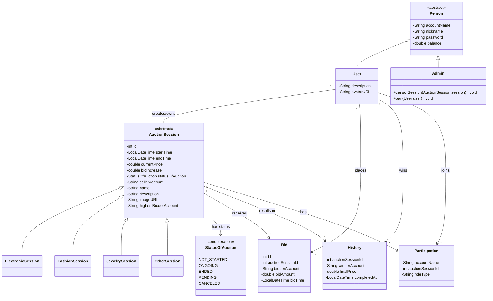
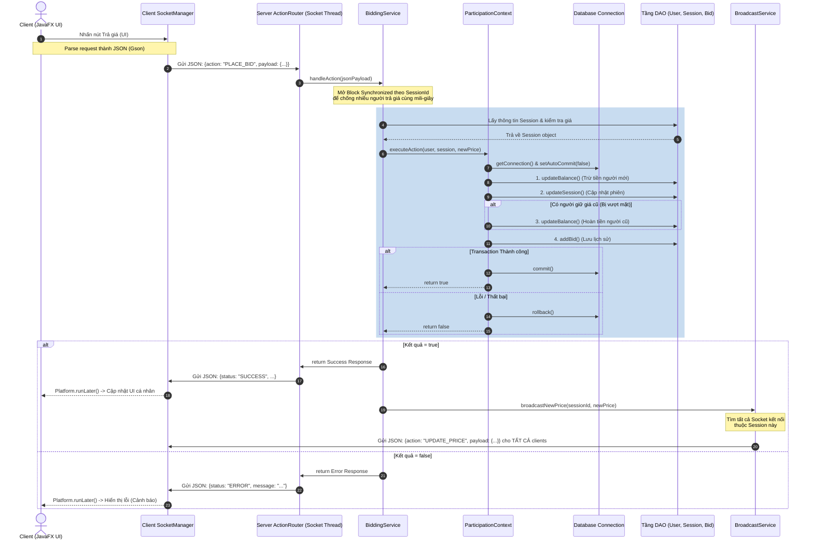
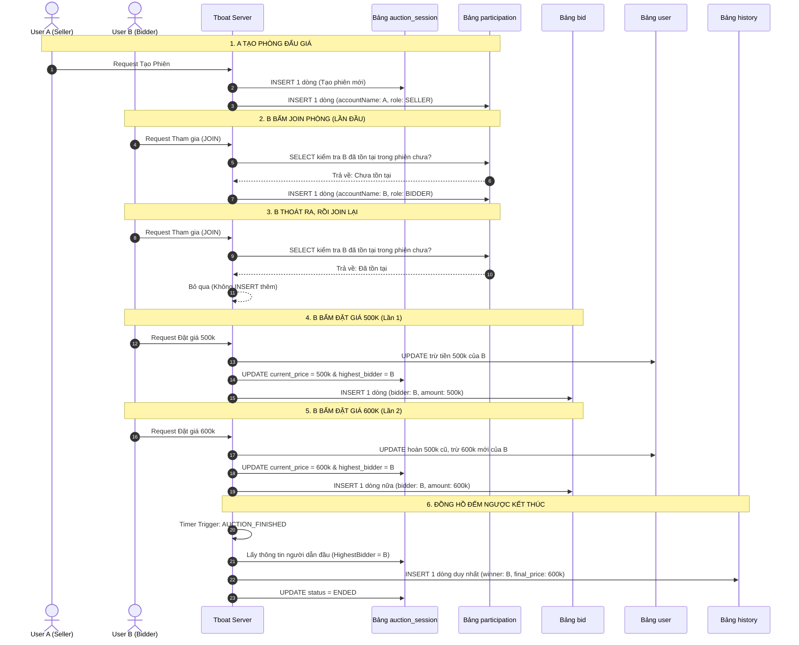

# Hệ Thống Đấu Giá Trực Tuyến (Real-time Auction System) - Nhóm 6
Đây là dự án Bài tập lớn của Nhóm 6. Hệ thống mô phỏng một sàn đấu giá trực tuyến theo thời gian thực (Real-time), cho phép người dùng tạo phiên đấu giá, tham gia trả giá, và cập nhật kết quả đồng bộ ngay lập tức thông qua giao thức Socket.

🚀 Công nghệ sử dụng
Ngôn ngữ: Java (Core/JavaFX)

Kiến trúc mạng: Java Socket (Mô hình Client-Server, TCP/IP)

Cơ sở dữ liệu: MySQL

Design Pattern: Strategy Pattern, Observer Pattern, Singleton Pattern, Factory Method Pattern

🌟 Tính năng chính
Đăng nhập/Đăng ký và quản lý hồ sơ người dùng, lịch sử giao dịch.

Real-time Bidding: Trả giá theo thời gian thực, tự động broadcast giá mới nhất đến tất cả người trong phòng.

Transaction Safety: Đảm bảo tính toàn vẹn dữ liệu khi nhiều người cùng trả giá một lúc (Xử lý đa luồng & Database Transaction).

Auto-close Session: Tự động đếm ngược và chốt phiên đấu giá khi hết giờ.

Quản lý hệ thống dành cho Admin (Duyệt phiên).

### Sơ đồ 1: Cấu trúc hệ thống (UML Class Diagram)

### Sơ đồ 2: Luồng Hệ Thống & Xử lý Kỹ Thuật (System Sequence Diagram)

### Sơ đồ 3: Luồng Nghiệp Vụ Database (Business Logic & Data Flow)

### Bảng chia việc chi tiết cho từng thành viên

 Thành viên | Nội dung nhiệm vụ |  tiến độ |
| :--- | :--- | :--- |
|  | Ghép nối code của cả nhóm |80% |
| **Phúc** | Thiết kế giao diện trang chủ, trang nạp rút, admin, trang đấu giá | 100%|
| **Phúc** | Xử lý cập nhật UI realtime và đọc dữ liệu để hiện thị  | 100%|
| **Tâm** | Thiết kế các unit test  |60% |
| **Tâm** | Xử lý Logic Broadcast (Gửi dữ liệu thời gian thực tới tất cả Client trong phòng) |100% |
| **Tâm** | Xây dựng Giao thức truyền tin | 100% |
| **Tâm** | Xử lý Đa luồng | 70% |
| **Thái** | Thiết kế các lớp Java thuần (User, Item,...) | 100% |
| **Thái** | Xử lý Validation dữ liệu & Bắt lỗi Ngoại lệ (Exception) | 70%|
| **Phú** | Thiết kế giao diện login, register, trang Profile, History, UploadItem | 100%|
| **Phú** | Lập trình tầng DAO (Data Access Object) & Thiết kế CSDL |100% |
| **Phú và Tâm** | Thiết kế kiến trúc Socket (Server/Client) & Vẽ sơ đồ UML |100% |
| **Tâm, Thái, Phú**| Code logic Bộ đếm thời gian (Timer) & Tự động chốt phiên đấu giá |100%|
| **Thái, Phú, Tâm** | Code logic Trả giá & Xử lý đồng bộ (Synchronized chống trùng lặp) |80%|
