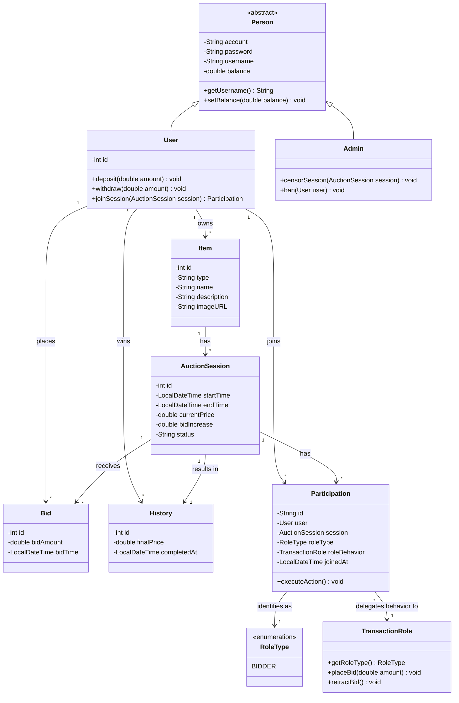

# Bai-tap-lon-nhom-6
làm hệ thống đấu giá

 Thành viên | Nội dung nhiệm vụ |  tiến độ |
| :--- | :--- | :--- |
| **Phúc** | Thiết kế giao diện trang chủ | 0%|
| **Phúc** | Thiết kế trang nạp rút | 0% |
| **Phúc** | Thiết kế trang đấu giá | 0% |
| **Phúc** | Thiết kế trang duyệt của admin |0% |
| **Phúc** | Tích hợp với giao diện của Phú | 0% |
| **Phúc** | Thêm các tính năng mở rộng |0% |
| **Phúc** | Xử lý cập nhật UI realtime và đọc dữ liệu để hiện thị  | 0%|
| **Tâm** | Thiết kế kiến trúc Socket (Server/Client)  |0% |
| **Tâm** | Xử lý Logic Broadcast (Gửi dữ liệu thời gian thực tới tất cả Client trong phòng) |0% |
| **Tâm** | Xây dựng Giao thức truyền tin | 0% |
| **Tâm** | Xử lý Đa luồng | 0% |
| **Thái** | Thiết kế các lớp Java thuần (User, Item,...) | 0% |
| **Thái** | Xử lý Validation dữ liệu & Bắt lỗi Ngoại lệ (Exception) | 0%|
| **Thái** | Code logic Trả giá & Xử lý đồng bộ (Synchronized chống trùng lặp) |0%|
| **Thái** | Code logic Bộ đếm thời gian (Timer) & Tự động chốt phiên đấu giá |0%|
| **Phú** | Thiết kế giao diện đăng nhập, đăng ký | 100%|
| **Phú** | Thiết kế trang Profile |100% |
| **Phú** | Thiết kế trang lịch sử | 100% |
| **Phú** | Thiết kế trang Upload Item |80%|
| **Phú** | Lập trình tầng DAO (Data Access Object) |0% |
| **Phú** | Xây dựng lớp Database Connection |0% |
| **Phú** | Thiết kế CSDL (ERD) & Viết file SQL |0% |